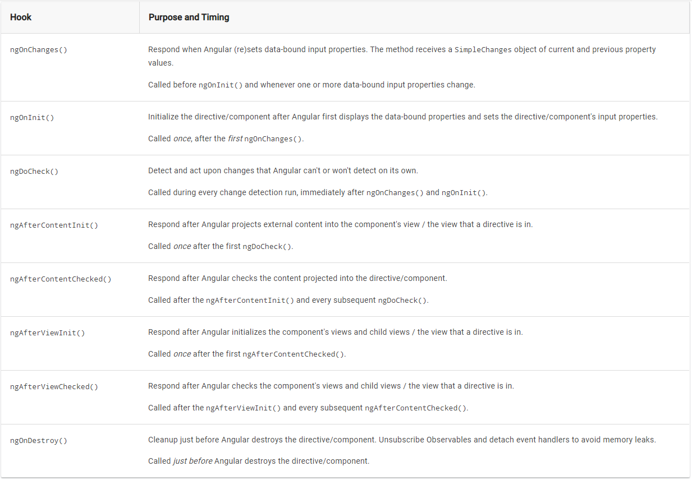
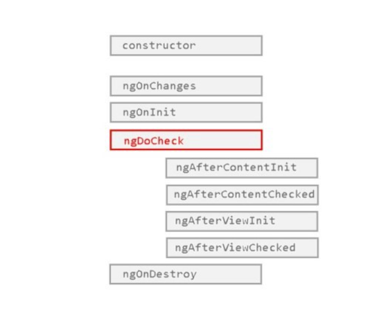

# Component Lifecycle hooks

- A component has a lifecycle managed by Angular.
- Angular creates it, renders it, creates and renders its children, checks it when its data-bound properties change, and destroys it before removing it from the DOM.
- Angular offers lifecycle hooks that provide visibility into these key life moments and the ability to act when they occur.
- A directive has the same set of lifecycle hooks.

## Lifecycle interface

- Developers can tap into key moments in that lifecycle by implementing one or more of the lifecycle hook interfaces in the Angular core library.
- Each interface has a single hook method whose name is the interface name prefixed with ng. For example, the OnInit interface has a hook method named ngOnInit() that Angular calls shortly after creating the component
- Angular only calls a directive/component hook method if it is defined.

```ts
export class PeekABoo implements OnInit {
  constructor(private logger: LoggerService) { }

  // implement OnInit's `ngOnInit` method
  ngOnInit() { this.logIt(`OnInit`); }

  logIt(msg: string) {
    this.logger.log(`#${nextId++} ${msg}`);
  }
}
```

## Lifecycle sequence

[Refer here](https://angular.io/guide/lifecycle-hooks#lifecycle-sequence)



### What is the use of ngDoCheck vs ngOnChange

## Is interfaces required for life-cycle events

In the example code We have mentioned the `OnInit` interface to the component class

`export class PeekABoo implements OnInit {` 

The JavaScript language doesn't have interfaces. Angular can't see TypeScript interfaces at runtime because they disappear from the transpiled JavaScript.

We don't have to add the lifecycle hook interfaces to directives and components.

Angular instead **inspects directive and component classes and calls the hook methods if they are defined**. Angular finds and calls methods like `ngOnInit()`, ****with or without the interfaces****

it's good practice to add interfaces to TypeScript directive classes in order to benefit from strong typing and editor tooling.

## Example all hooks

[click here to see example](http://stackblitz.com/angular/xeoobrkorke)



### ngOnChanges

This method is called once on component’s creation and then every time changes are detected in one of the component’s input properties. It receives a SimpleChanges object as a parameter, which contains information regarding which of the input properties has changed

```js
ngOnChanges(changes: SimpleChanges) {

  // changes Is and Object which contains changed variable as key and old and new values as it's object, for example
  /** {
      schoolName : {
        oldValue : 'GBHSS'
        newValue : 'Orchid international school'
      },
      city:{
        oldValue : 'Pattukkottai'
        newValue : 'Bangalore'
      }
  }**/

    }
```

#### Use cases

It is very useful if you need to handle any specific logic in the component based on the received input property.

### ngOnInit

This method is called only **once** during the component lifecycle, after the first `ngOnChanges` call. At this point, within this method, you can have access not only to `data-bound properties` but also the component’s `input` ( @input ) properties.

```js
export class MyComponent implements OnInit {
  ngOnInit() {
      // Insert Logic Here!
  }
}
```

#### Use cases ngOnInit

- This is one of the most used lifecycle hooks in Angular. Here is where you might set requests to the server to load content,
- create a FormGroup for a form to be handled by that component, set subscriptions and much more.
- Basically, it is where you can perform any initializations shortly after the component’s construction.

The below is a example of a register form component and you’d like to create the form based on fields received from the server that are fetched according to an user type.

```js
export class RegisterFormComponent implements OnInit {
  public formGroup: FormGroup;
  private _userType: UserTypeEnum;
  constructor(
    private _activatedRoute: ActivatedRoute,
    private _myService: MyService
  ) {
    this._userType =
      this._activatedRoute.snapshot.paramMap.get('userType');
  }
  ngOnInit() {
    this._myService.getFormFieldsByType(
      this._userType
    ).subscribe((response) => {
      this.formGroup = this._createForm(
        response.data
      );
    }, (error) => console.error( error ) );
  }
  private _createForm(formFields: Array<FormFields>): FormGroup {
    // FormGroup Creation Logic!
  }
}

```

#### Constructor vs ngOnInit

Why initialization logic goes inside ngOnInit instead of constructor of the class. Because

- because the Javascript engine is what handles the constructor, not Angular.
- his is one of the reasons why the ngOnInit hook was created
- Also, due to the fact that you can’t yet access component’s Input properties on the constructor.

### ngDoCheck

This hook can be interpreted as an “extension” of ngOnChanges. You can use this method to detect changes that Angular can’t or won’t detect

It is called in every change detection, immediately after the ngOnChanges and ngOnInit hooks.

```js
export class MyComponent implements DoCheck {
  ...
  private _currentValue;
  private _previousValue;
  public changeDetected: boolean = false;
  ...
  ngDoCheck() {
    if (this._previousValue !== this._currentValue) {
      this.changeDetected = true;
      // Insert Logic Here
    }
  }
}
```

this **hook is really costly**, since it is called with enormous frequency; after every change detection cycle no matter where the change occurred. Therefore, its usage should be careful in order to not affect the user experience

### ngAfterContentInit

These hooks mainly for @ContentChild or @ContentChildren Decorators
Refer @ContentChild [here](./angular_decorators.md#content-children)

- This method is called only once during the component’s lifecycle, after the first `ngDoCheck`. Within this hook, we have access for the first time to the `ElementRef` of the `ContentChild` after the component’s creation;

```js
Component({
  selector: 'my-component',
  template: `
    <div>
      <ng-content></ng-content>
    </div>`
})
export class MyComponent implements AfterContentInit {
  @ContentChild('content') content: ElementRef;

  ngAfterContentInit() {
    // Now we have access to 'this.content'!
    // Insert Logic Here!
  }
}
```

### ngAfterContentChecked

- This method is called **once** during the component’s lifecycle after `ngAfterContentInit` and then after **every subsequent ngDoCheck**.
- It is called after Angular has already checked the content projected into the component in the `current digest loop`.

```js
@Component({
  selector: 'my-component',
  template: `
    <div>
      <ng-content></ng-content>
    </div>`
})
export class MyComponent implements AfterContentChecked {
  @ContentChild('content') content: ElementRef;

  ngAfterContentChecked() {
    // We have access to 'this.content'!
    // Content has already been checked!
    // Insert Logic Here!
  }
}
```

### ngAfterViewInit

This method is called only **once** during the component’s lifecycle, after `ngAfterContentChecked`. Within this hook, we have access for the first time to the `ElementRefs` of the `ViewChildren` after the component’s creation; after Angular has already composed the component’s views and its child views.

```js
@Component({
  selector: 'my-component',
  template: `
    <div #wrapper >
      ...
    </div>`
})
export class MyComponent implements AfterViewInit {
  @ViewChild('wrapper') wrapper: ElementRef;

  ngAfterViewInit() {
    // Now we have access to 'this.wrapper'
    // Insert Logic Here!
  }
}
```

#### ngAfterViewInit use case

This hook is quite useful when you **need to load content on your view that depends on its view’s components**; for instance when you need to set a video player or create a chart from a canvas element. Below is an example on how you could set a chart using the `ngAfterViewInit` hook.

```js
@Component({
  selector: 'my-component',
  template: `
    <div>
      <canvas id="myCanvas" ></canvas>
    </div>`
})
export class MyComponent implements AfterViewInit {

  @viewChild('canvas') chart : ElementRefs

  ngAfterViewInit() {
    // Now we can get the canvas element by its id
    // in order to create the chart
    this.chart = new Chart('radarCanvas', {
      ...
    });
  }
}
```

### ngAfterViewChecked

This method is called **once** after `ngAfterViewInit` and then **after every subsequent `ngAfterContentChecked`**. It is called after Angular has already checked the component’s views and its child views in the current digest loop.

```js
@Component({
  selector: 'my-component',
  template: `
    <div #wrapper >
      ...
    </div>`
})
export class MyComponent implements AfterViewChecked {
  @ViewChild('wrapper') wrapper: ElementRef;

  ngAfterViewChecked() {
    // Now we have access to 'this.wrapper'!
    // View has already been checked!
    // Insert Logic Here!
  }
}
```

### ngOnDestroy

Lastly, this method is called only **once** during the component’s lifecycle, **right before Angular destroy it**. Here is where you should inform the rest of your application that the component is being destroyed, in case there are any actions to be done regarding that information.

```js
export class MyComponent implements OnDestroy {
  ngOnDestroy() {
      // Insert Logic Here!
  }
}
```

### use case ngOnDestroy

Also it is where you should put all your **cleanup logic** for that component. For instance, it is where you can remove any **localstorage information** and, most importantly,**unsubscribe observables/detach** **event handlers/stop timers**, etc. to **avoid memory leaks**.


https://medium.com/bb-tutorials-and-thoughts/angular-understanding-angular-lifecycle-hooks-with-a-sample-project-375a61882478
https://itnext.io/understanding-angular-life-cycle-hooks-91616f8946e3

In-Depth articles yet to read
https://blog.angularindepth.com/everything-you-need-to-know-about-change-detection-in-angular-8006c51d206f

https://blog.angularindepth.com/everything-you-need-to-know-about-change-detection-in-angular-8006c51d206f