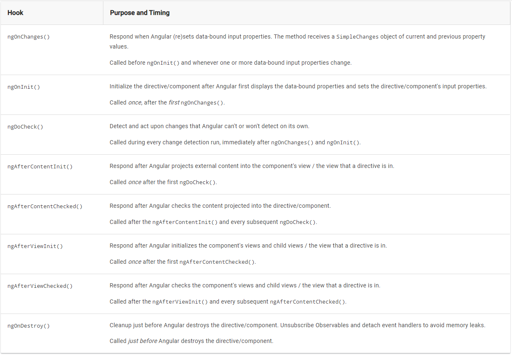

# Component Lifecycle hooks

- A component has a lifecycle managed by Angular.
- Angular creates it, renders it, creates and renders its children, checks it when its data-bound properties change, and destroys it before removing it from the DOM.
- Angular offers lifecycle hooks that provide visibility into these key life moments and the ability to act when they occur.
- A directive has the same set of lifecycle hooks.

## Lifecycle interface
- Developers can tap into key moments in that lifecycle by implementing one or more of the lifecycle hook interfaces in the Angular core library.
- Each interface has a single hook method whose name is the interface name prefixed with ng. For example, the OnInit interface has a hook method named ngOnInit() that Angular calls shortly after creating the component
- Angular only calls a directive/component hook method if it is defined.

```ts
export class PeekABoo implements OnInit {
  constructor(private logger: LoggerService) { }

  // implement OnInit's `ngOnInit` method
  ngOnInit() { this.logIt(`OnInit`); }

  logIt(msg: string) {
    this.logger.log(`#${nextId++} ${msg}`);
  }
}
```

## Lifecycle sequence

[Refer here](https://angular.io/guide/lifecycle-hooks#lifecycle-sequence)



## Is interfaces required for life-cycle events

In the example code We have mentioned the `OnInit` interface to the component class

`export class PeekABoo implements OnInit {` 

The JavaScript language doesn't have interfaces. Angular can't see TypeScript interfaces at runtime because they disappear from the transpiled JavaScript.

We don't have to add the lifecycle hook interfaces to directives and components.

Angular instead *inspects directive and component classes and calls the hook methods if they are defined*. Angular finds and calls methods like `ngOnInit()`, **with or without the interfaces**

it's good practice to add interfaces to TypeScript directive classes in order to benefit from strong typing and editor tooling.

## Example all hooks

[click here to see example](http://stackblitz.com/angular/xeoobrkorke)
