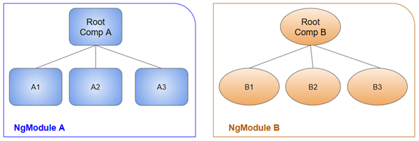

# module

- Angular has its own modularity system called `NgModules`

- `NgModules` are containers for a cohesive block of code dedicated to an application domain, a workflow, or a closely related set of capabilities.

- They can contain components, service providers, and other code files whose scope is defined by the containing NgModule.

- Every Angular app has at least one NgModule class, the `root module`, which is conventionally named `AppModule` and resides in a file named `app.module.ts`. You launch your app by bootstrapping the root NgModule.

## ngModule

An NgModule is defined by a `class decorated` with `@NgModule()`
The `@NgModule()` decorator is a function that takes a single `metadata object`.

### metadata object

- **declarations** =>  components, directives, and pipes
- **exports** => subset of declarations that should be visible and usable in the component templates of other NgModules.
- **imports** => Other modules whose exported classes are needed by component templates declared in this NgModule.
- **providers** => Service which it make it available all part of the application
- **bootstrap** => The main application view, called the root component, which hosts all other app views. *Only the root NgModule should set the bootstrap property.*

## Root component

`NgModules` provide a compilation context for their components. A `root NgModule` always has a `root component` that is created during bootstrap.

ngModule can include any number of additional components, which *can be loaded through the router or created through the template*.



## imports  

### Importing decorator

For example, import Angular's Component decorator from the @angular/core library like this.

```ts
import { Component } from '@angular/core';
```

### Importing another ngModule

```ts
import { BrowserModule } from '@angular/platform-browser';
```

Also need to add the module in `imports` of ngModule to make it available through out the angular application

```ts
imports:      [ BrowserModule ],

```
