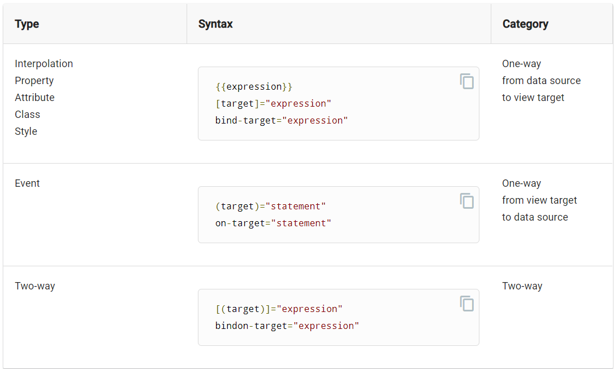

# Template syntax

```html
<h2>Products</h2>
<div *ngFor="let product of products">
  <h3>
    <a [title]="product.name + ' details'">
      {{ product.name }}
    </a>
  </h3>
   <p *ngIf="product.description">
    Description: {{ product.description }}
  </p>
  <button (click)="share()">
    Share
  </button>
</div>
<input [(user.name)] /> //two way data binded variable
```

Based on the above code we have learned 5 things

- *ngFor
- *ngIf
- Interpolation {{ }}
- Property binding [ ]
- Event binding ( )
- Two way binding [()]

## Three ways of data binding in angular

- From the source-to-view
- From view-to-source
- Two-way sequence: view-to-source-to-view



The target of a binding is the property or event inside the binding punctuation: [], () or [()].

## HTML Attribute binding

```html
<!-- Bind button disabled state to `isUnchanged` property -->
<button [disabled]="isUnchanged">Save</button>
```

## HTML Attribute vs DOM property

- Attributes are defined by HTML. Properties are accessed from DOM, or the Document Object Model, nodes.

- attributes initialize DOM properties and then they are done. Property values can change; attribute values can't.

- So it is not necessary that a DOM change result in HTML change

## input

### Example 1


```html
<input [(name)] />
<button (click)="add()"></button>
```

Inside component

```ts
private name : string;
add():{
  this.nameService.add(name);
}
```

### Example 2

```html
    <input #heroName />
    <button (click)="add(heroName.value); heroName.value=''">
```

inside component

```ts
add(name:string):{
  this.nameService.add(name);
}
```
