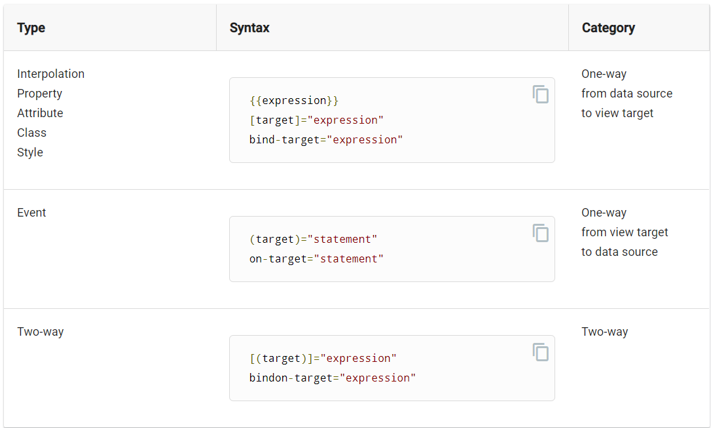
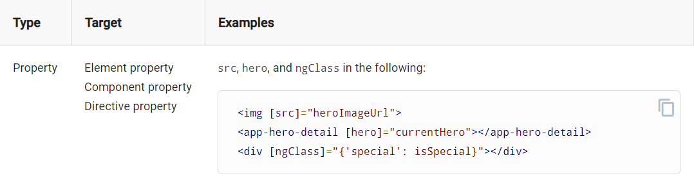
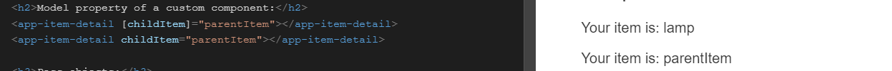
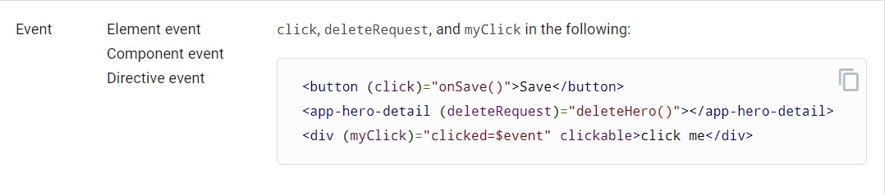
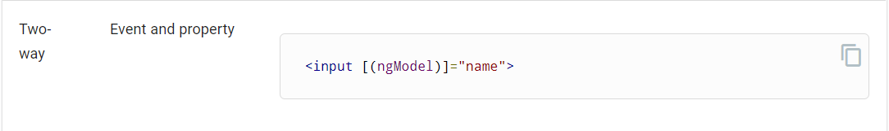
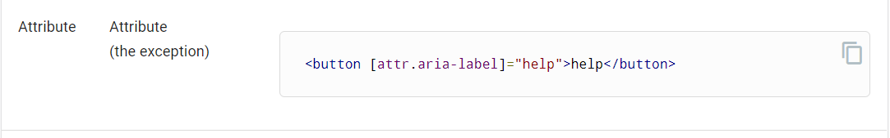
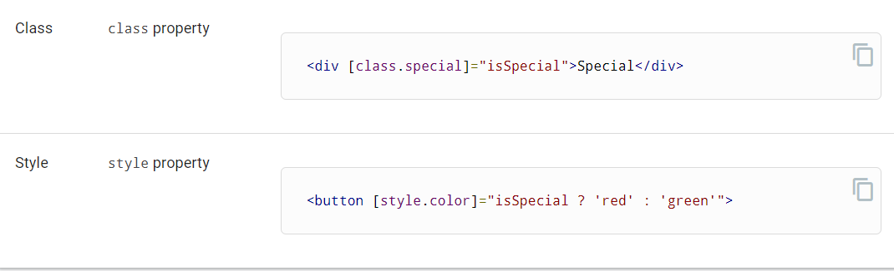
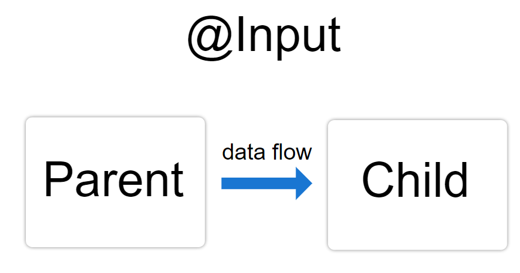
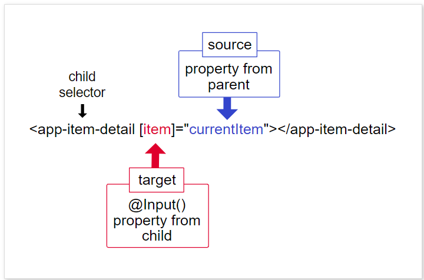
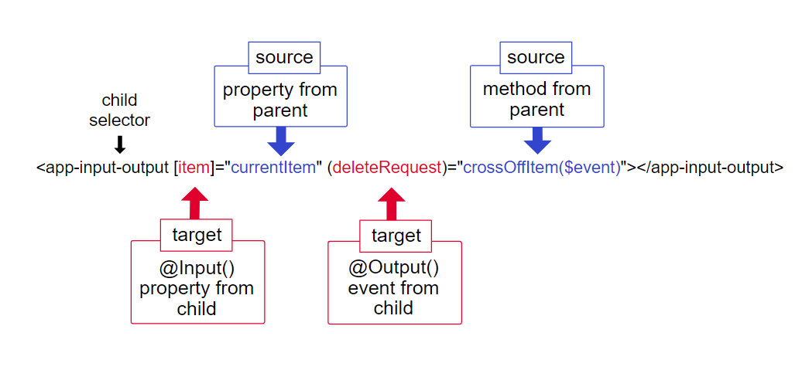

# Template syntax

```html
<h2>Products</h2>
<div *ngFor="let product of products">
  <h3>
    <a [title]="product.name + ' details'">
      {{ product.name }}
    </a>
  </h3>
   <p *ngIf="product.description">
    Description: {{ product.description }}
  </p>
  <button (click)="share()">
    Share
  </button>
</div>
<input [(user.name)] /> //two way data binded variable
```

Based on the above code we have learned 5 things

- *ngFor
- *ngIf
- Interpolation {{ }}
- Property binding [ ]
- Event binding ( )
- Two way binding [()]

## Three ways of data binding in angular

- From the source-to-view
- From view-to-source
- Two-way sequence: view-to-source-to-view



The target of a binding is the property or event inside the binding punctuation: [], () or [()].

## HTML Attribute binding

```html
<!-- Bind button disabled state to `isUnchanged` property -->
<button [disabled]="isUnchanged">Save</button>
```

## HTML Attribute vs DOM property

- Attributes are defined by HTML. Properties are accessed from DOM, or the Document Object Model, nodes.

- attributes initialize DOM properties and then they are done. Property values can change; attribute values can't.

- So it is not necessary that a DOM change result in HTML change

### Binding Targets Table

#### Property



Sample when we don't bind the property, value of parentItem is lamp



#### Event



#### Two way data binding



#### Attribute



#### class and style



## Property Binding vs interpolation

You often have a choice between interpolation and property binding. The following binding pairs do the same thing

```html
<p> is the <i>interpolated</i> image.</p>
<p> is the <i>property bound</i> image.</p>

<p><span>"{{interpolationTitle}}" is the <i>interpolated</i> title.</span></p>
<p>"<span [innerHTML]="propertyTitle"></span>" is the <i>property bound</i> title.</p>
```

## content-Security

### Interpolation

```ts
evilTitle = 'Template <script>alert("evil never sleeps")</script> Syntax';
```

```html
<p><span>"{{evilTitle}}" is the <i>interpolated</i> evil title.</span></p>
```

Output

```output
"Template <script>alert("evil never sleeps")</script> Syntax" is the interpolated evil title.
```

During Interpolation angular makes sure no scripts tag get's exeucted, The script tas displayed as text

### Property Binding

```html
<!--

 WARNING: sanitizing HTML stripped some content (see http://  g.co/ng/security#xss).
-->
<p>"<span [innerHTML]="evilTitle"></span>" is the <i>property bound</i> evil title.</p>
```

```output
"Template alert("evil never sleeps")Syntax" is the property bound evil title.
```

## Attribute Binding

*wrong* will throw error

```html
<tr><td colspan="{{1 + 1}}">Three-Four</td></tr>
```

*right* validates correctly

```html
<tr><td [colSpan]="1 + 1">Three-Four</td></tr>
```

## Class binding

```html
<h3>Overwrite all existing classes with a new class:</h3>
<div class="item clearance special" [attr.class]="resetClasses">Reset all classes at once</div>
```

Adding a new class without overwriting the existing class attirbute and values

```html
<h3>Add a class:</h3>
<div class="item clearance special" [class.item-clearance]="itemClearance">Add another class</div>
```

Class toggle

```html
<div [class.special]="isSpecial">The class binding is special.</div>
```

Use `NgClass` when handling multiple classes

## Event binding

```html
<button (click)="onSave($event)">Save</button>
```

Without `ngModel` event binding with input

```html
<input [value]="currentItem.name"
       (input)="currentItem.name=$event.target.value" >
```

### CustomEvents

Defining custom events

```ts
@Output() deleteRequest = new EventEmitter<Item>();

delete() {
  this.deleteRequest.emit(this.item);
  this.displayNone = this.displayNone ? '' : 'none';
  this.lineThrough = this.lineThrough ? '' : 'line-through';
}
```

```html
<app-item-detail (deleteRequest)="deleteItem($event)" [item]="currentItem"></app-item-detail>
```

## Two way data binding ( parent child component )

[](https://angular.io/guide/template-syntax#basics-of-two-way-binding)

## Built in directives

### NgClass

*simple example* -

```html
<div [ngClass]="isSpecial ? 'special' : ''">This div is special</div>
```

*Multiple classes* -

```html
<div [ngClass]="currentClasses">This div is initially saveable, unchanged, and special.</div>
```

```ts
  this.currentClasses =  {
    'saveable': true,
    'modified': this.dirty,
    'special':  true
  };
```

### NgStyle

#### simple example NgStyle

```html
<div [style.font-size]="isSpecial ? 'x-large' : 'smaller'">
  This div is x-large or smaller.
</div>
```

#### Multiple classes NgStyle

```html
<div [ngStyle]="currentStyles">
  This div is initially italic, normal weight, and extra large (24px).
</div>
```

```ts
this.currentStyles = {
    'font-style':  this.canSave      ? 'italic' : 'normal',
    'font-weight': !this.isUnchanged ? 'bold'   : 'normal',
    'font-size':   this.isSpecial    ? '24px'   : '12px'
  };
```

### NgModel

it is part of `FormsModule`, need to be imported in NgModule before using NgModel

```html
<label for="example-ngModel">[(ngModel)]:</label>
<input [(ngModel)]="currentItem.name" id="example-ngModel">
```

### ngSwitch

ngSwitch is like the JavaScript switch statement. It displays one element from among several possible elements, based on a switch condition. Angular puts only the selected element into the DOM.

```ts
<div [ngSwitch]="currentItem.feature">
  <app-stout-item    *ngSwitchCase="'stout'"    [item]="currentItem"></app-stout-item>
  <app-device-item   *ngSwitchCase="'slim'"     [item]="currentItem"></app-device-item>
  <app-lost-item     *ngSwitchCase="'vintage'"  [item]="currentItem"></app-lost-item>
  <app-best-item     *ngSwitchCase="'bright'"   [item]="currentItem"></app-best-item>
  <app-unknown-item  *ngSwitchDefault           [item]="currentItem"></app-unknown-item>
</div>
```

## Template reference variables (#var)

### As input binder

```html
<input #phone placeholder="phonenumber" />
<button (click)="callPhone(phone.value)">Call</button>
```

### As a reference to element it present

```html
<div>
  <h2>Template reference variable with disabled button</h2>
  <p>btn refers to the button element.</p>
  <button
    #btn
    disabled
    [innerHTML]="'disabled by attribute: ' + btn.disabled"
  ></button>
</div>
```

### Using As a reference to form

```html
<form #itemForm="ngForm" (ngSubmit)="onSubmit(itemForm)"> <!-- onSubmit function will be defined in component -->
  <label for="name"
    >Name <input class="form-control" name="name" ngModel required />
  </label>
  <button type="submit">Submit</button>
</form>

<p>JSON: {{ itemForm.form.value | json }}</p> <!-- will show the value which we type in name input -->
```

## @Input and @Output properties

### @Input



```html
<parent-component>
  <child-component></child-component>
</parent-component>
```

Here, the `<child-component>` selector, or child directive, is embedded within a `<parent-component>`, which serves as the child's context.

- Use the `@Input()` decorator in a child component or directive to let Angular know that a property in that component can receive its value from its parent component.

#### Usage of @Input in child component

```ts
import { Component, Input } from '@angular/core'; // First, import Input
export class ItemDetailComponent {
  @Input() item: string; // decorate the property with @Input()
}
```

Passing the value to child
```ts
<app-item-detail [item]="currentItem"></app-item-detail>
```




### @Output

In child

```ts
import { Output, EventEmitter } from '@angular/core';
export class ItemOutputComponent {

  @Output() deleteRequest = new EventEmitter<string>();
  @Input() item: string; // decorate the property with @Input()

  listItem(){
    console.log(this.item)
  }

  addNewItem(value: string) {
  }

  deleteItem(value: string){
    this.deleteRequest.emit(value);
  }
}
```



## Template expression operators

### The pipe operator ( | )

```html
<p>Title through uppercase pipe: {{title | uppercase}}</p>
```

```html
<!-- convert title to uppercase, then to lowercase -->
<p>Title through a pipe chain: {{title | uppercase | lowercase}}</p>
```

json pipe

```html
<!-- Helps debugging -->
<p>Item json pipe: {{item | json}}</p>
```

output of json pipe

```json
{ "name": "Telephone",
  "manufactureDate": "1980-02-25T05:00:00.000Z",
  "price": 98 }
```

### Safe navigation operator ( ? )

```html
<p>The item name is: {{item?.name}}</p>
```

If there is no safe operator then error will be thrown `TypeError: Cannot read property 'name' of null.` and rendering will be broken for the component

### The non-null assertion operator ( ! )

it tells the TypeScript type checker to suspend strict null checks for a specific property expression.

```html
<p *ngIf="item">The item's color is: {{item!.color}}</p>
```

## Build in template functions

### $(any) type cast function

When the Angular compiler turns this template into TypeScript code, it prevents TypeScript from reporting that `bestByDate` is not a member of the `item` object when it runs type checking on the template.

```html
<p>The item's undeclared best by date is: {{$any(item).bestByDate}}</p>
```
