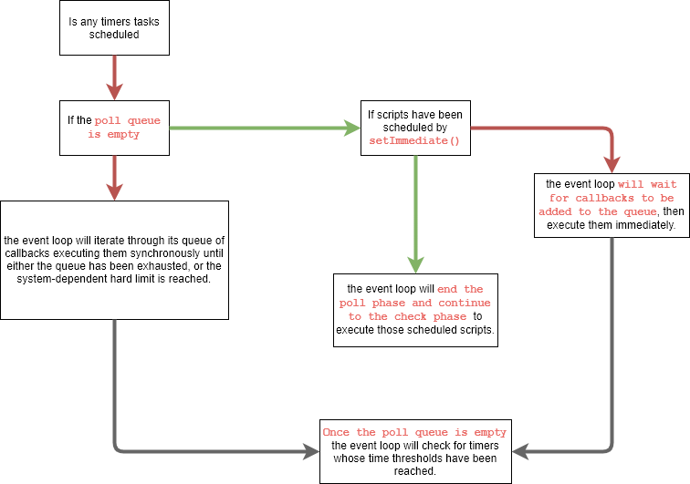

# node

## Single threaded and Event Driven

Node.js is an event-based platform
This means that everything that happens in Node is the reaction to an event

When Node.js starts, it initializes the `event loop`, processes the provided input script

Javascript is a single-threaded, event-driven language. This means that we can attach listeners to events, and when a said event fires, the listener executes the callback we provided.

There is only one thread that executes NodeJS code and this is the thread where the event loop is running.

## Eventloop

### Eventloop order of operations

```js
┌───────────────────────────┐
┌─>│           timers          │
│  └─────────────┬─────────────┘
│  ┌─────────────┴─────────────┐
│  │     pending callbacks     │
│  └─────────────┬─────────────┘
│  ┌─────────────┴─────────────┐
│  │       idle, prepare       │
│  └─────────────┬─────────────┘      ┌───────────────┐
│  ┌─────────────┴─────────────┐      │   incoming:   │
│  │           poll            │<─────┤  connections, │
│  └─────────────┬─────────────┘      │   data, etc.  │
│  ┌─────────────┴─────────────┐      └───────────────┘
│  │           check           │
│  └─────────────┬─────────────┘
│  ┌─────────────┴─────────────┐
└──┤      close callbacks      │
   └───────────────────────────┘
```

- Each phase has a FIFO queue of callbacks to execute.

- when the event loop enters a given phase it execute callbacks in that phase's queue until the queue has been exhausted or the maximum number of callbacks has executed.

- When the queue has been exhausted or the callback limit is reached, the event loop will move to the next phase,

### Eventloop naming convention

It's is loopa where which will looping for the event Callbacks to be called executed

### Eventloop phases

#### Timers phase

- this phase executes callbacks scheduled by `setTimeout()` and `setInterval()`
- A timer specifies the *threshold* after which a provided callback may be executed rather than the exact time a person wants it to be executed. Timers callbacks will run as early as they can be scheduled after the specified amount of time has passed
- however, Operating System scheduling or the running of other callbacks may delay them

#### Pending callbacks phase

- This phase executes callbacks for some system operations such as *types of TCP errors*.
- For example if a TCP socket receives `ECONNREFUSED` when attempting to connect, some *nix systems want to wait to report the error. This will be queued to execute in the pending callbacks phase.

#### poll phase

It has two main functionalities

1. Calculating how long it should block and poll for I/O, then
2. Processing events in the poll queue.

When the event loop enters the poll phase and



#### check phase

- This phase allows a person to execute callbacks immediately after the poll phase has completed.
- If the poll phase becomes idle and scripts have been queued with `setImmediate()`, the event loop may continue to the check phase rather than waiting.

#### close callbacks

- If a socket or handle is closed abruptly (e.g. socket.destroy()), the 'close' event will be emitted in this phase.

### Process.nexttick

`process.nextTick(callback[, ...args])`

it's a part of the asynchronous API.  `process.nextTick()` is not technically part of the event loop.

- the `nextTickQueue` will be processed after the current operation is completed, regardless of the current phase of the event loop

- any time we call process.nextTick() in a given phase, all callbacks passed to `process.nextTick()` will be resolved before the event loop continues.

- process.nextTick() which is used by developers in realtime applications everyday to defer the execution of a function until the next Event Loop Iteration.

```js
console.log('start');
process.nextTick(() => {
  console.log('nextTick callback');
});
console.log('scheduled');
// Output:
// start
// scheduled
// nextTick callback
```

#### why doe we need Process.nextick

This is important when developing APIs in order to give users the opportunity to  *assign event handlers after an object has been constructed* but *before any I/O has occurred*:

Incase if any code or function seems unsure weather is sync or asnyc

```js
// WARNING!  DO NOT USE!  BAD UNSAFE HAZARD!
function maybeSync(arg, cb) {
  if (arg) {
    cb();
    return;
  }

  fs.stat('file', cb);
}
```

the above API is hazardous because in the following case:

```js
const maybeTrue = Math.random() > 0.5;

maybeSync(maybeTrue, () => {
  foo();
});

bar();
```

It is not clear whether `foo()` or `bar()` will be called first.

```js
function definitelyAsync(arg, cb) {
  if (arg) {
    process.nextTick(cb);
    return;
  }

  fs.stat('file', cb);
}
```

## Taskqueue

Also called as  `event queue`, or `message queue`

Whenever you call `setTimeout`, `http.get` or `fs.readFile`, Node.js sends these operations to a different thread allowing V8 to keep executing our code. Node also calls the callback when the counter has run down or the IO / http operation has finished.

we only have one main thread and one call-stack, so in case there is another request being served when the said file is read

its callback will need to wait for the stack to become empty. The limbo where callbacks are waiting for their turn to be executed is called the `task queue`

## Micro Task and Macro tasks

Microtasks

- `process.nextTick`

- `promises`

Macrotasks

- `setTimeout`

- `setInterval`

- `setImmediate`

- `I/O`

### Example code and explanation

- exactly one (macro)task should get processed from the macrotask queue in one cycle of the event loop.

- macrotask has finished, all of the available microtasks will be processed within the same cycle. While these microtasks are being processed, they can queue more microtasks, which will all be run one by one, until the microtask queue is exhausted.

```js
console.log('script start')

const interval = setInterval(() => {
  console.log('setInterval')
}, 0)

setTimeout(() => {
  console.log('setTimeout 1')
  Promise.resolve().then(() => {
    console.log('promise 3')
  }).then(() => {
    console.log('promise 4')
  }).then(() => {
    setTimeout(() => {
      console.log('setTimeout 2')
      Promise.resolve().then(() => {
        console.log('promise 5')
      }).then(() => {
        console.log('promise 6')
      }).then(() => {
        clearInterval(interval)
      })
    }, 0)
  })
}, 0)

Promise.resolve().then(() => {
  console.log('promise 1')
}).then(() => {
  console.log('promise 2')
})
```

Output

```output
script start
promise1
promise2
setInterval
setTimeout1
promise3
promise4
setInterval
setTimeout2
promise5
promise6
```

## How and where async tasks gets executed

`Libuv` by default creates a `thread pool` with four threads to offload asynchronous work to.

Today’s operating systems already provide `asynchronous interfaces for many I/O tasks` (e.g. AIO on Linux).
Whenever possible, `libuv` will use those asynchronous interfaces, avoiding usage of the thread pool. The same applies to third party subsystems like databases. Here the authors of the driver will rather use the asynchronous interface than utilizing a thread pool.
In short: *Only if there is no other way, the thread pool will be used for asynchronous I/O.*

https://blog.risingstack.com/node-js-at-scale-understanding-node-js-event-loop/

https://medium.com/the-node-js-collection/what-you-should-know-to-really-understand-the-node-js-event-loop-and-its-metrics-c4907b19da4c

https://nodejs.org/en/docs/guides/event-loop-timers-and-nexttick/

https://www.youtube.com/watch?v=PNa9OMajw9w

https://developer.mozilla.org/en-US/docs/Web/JavaScript/EventLoop#Run-to-completion
